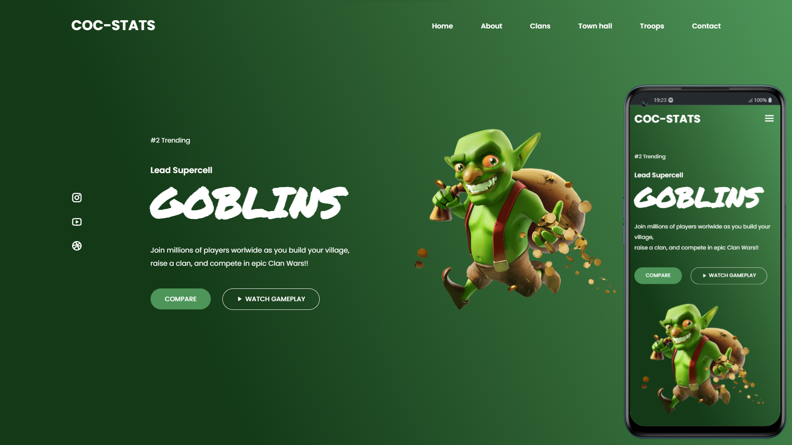

<h2 align="center">
   
    &nbsp; Goblins Web Page &nbsp; 
  
</h2>

Página web responsiva com o tema Goblins.  

  <a href="#-tecnologias">Tecnologias</a>&nbsp;&nbsp;&nbsp;|&nbsp;&nbsp;&nbsp;
  <a href="#-projeto">Projeto</a>&nbsp;&nbsp;&nbsp;|&nbsp;&nbsp;&nbsp;
  <a href="#-layout">Layout</a>&nbsp;&nbsp;&nbsp;|&nbsp;&nbsp;&nbsp;
  <a href="#memo-licença">Licença</a>

  

 

  

## 🚀 Tecnologias

Esse projeto foi desenvolvido com as seguintes tecnologias:

- HTML e CSS
- JavaScript
- Git e Github

## 💻 Projeto

Uma página web desenvolvidas com ferramentas básicas da web com design clean e responsivo.

- [Acesse o projeto finalizado, online](https://mateus-castellar.github.io/goblins-web-page)

## :memo: Licença

Esse projeto está sob a licença MIT.
